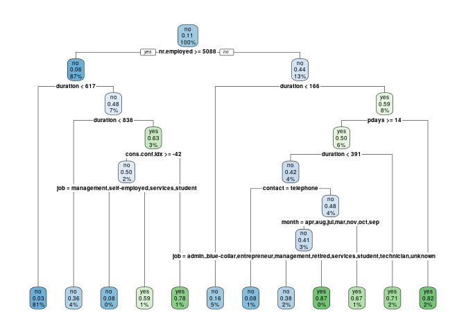

<!-- README.md is generated from README.Rmd. Please edit that file -->

## Overview

This package offers a series of functions that will clean, transform and
build a decision tree model for your input dataset. The functions are
split in different R scripts inside the R folder and should be executed
as explained below.

## Function Description

clean\_data : This function will check if the target variable contains
missing calues and returns an error. It also gives warnings if other
variables contain NAs and removes thoe columns that have more than 50%
NAs.

transform\_data : Data transformation step transforms the numeric
variables using log and transforms factors into numeric variables (and
vice versa).

model\_data : This function builds a decision tree for the provided
dataset.

model\_plot : Plots the decision tree created in the precious step.

model\_predict: Returns the predicted classes from the decision tree.

model\_performance : This functions calculated the accuracy of the
model.

## Usage

Here is how to use the package

``` r
library(bmarketing)
df <- import_data_from_csv("~/CloudStation/Projekte/r_projects/bmarketing2.csv")
#> Warning: Missing column names filled in: 'X1' [1]
##clean_data(df, target_var = "Y")

df[is.na(df$Y), "Y"] <- 0
df <- clean_data(df, target_var = "Y")
#> Warning in clean_data(df, target_var = "Y"): Column(s) HOUSING, POUTCOME,
#> MONTH have too many NAs and will be excluded

df <- transform_data(df, c("AGE", "DURATION"))

target_var <- "Y"
m <- model_data(df, target_var)

model_plot(m)
```

<!-- -->

``` r

target <- df[, target_var][[1]]
predictions <- model_predict(m, df)


model_performance(target, predictions)
#> $accuracy
#> [1] 0.8131207
#> 
#> $sensitivity
#> [1] NaN
#> 
#> $specificity
#> [1] 0.8499763
```
